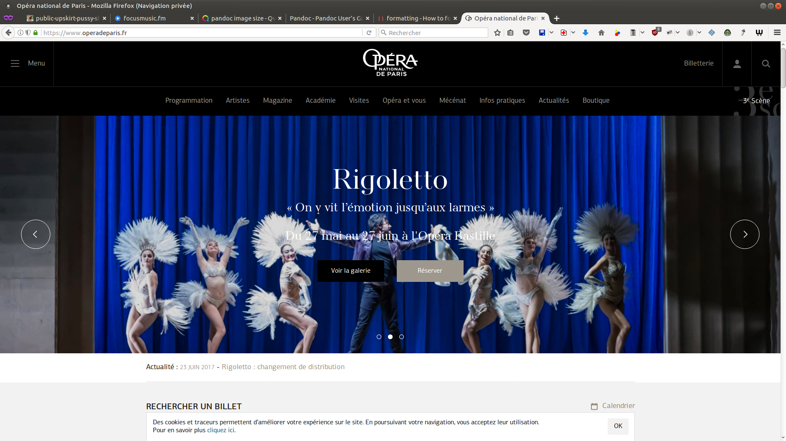
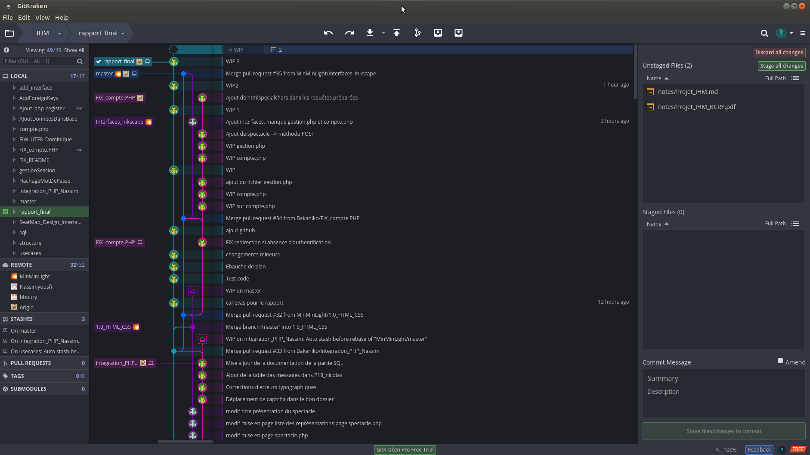

[//]: # (This may be the most platform independent comment)

# Introduction

Ce projet nous a été confié dans le cadre du Master *Mathématiques et Informatique
Appliquées aux Sciences Humaines et Sociales* (**MIASHS**) parcours *Technologie
et handicap* (**HANDI**). Il s'agit d'un projet associant les cours d'Interface
Homme Machine (Dominique Archambauld) et Programmation Web Accessible (Isis Truck)
de la première année.

L'objectif est de développer un site web permettant la réservation de place de
spectacle. Le site doit être accessible et donc fonctionnel pour des personnes en
situation de handicap (visuel ou moteur).

Nous avons voulu travailler sur un cas le plus concret possible, c'est pourquoi
nous nous sommes inspirés du site de l'Opéra national de Paris.

Si les spectacles présentés dans ce projet ont réellement eu lieu, soit à l'Opéra
Bastille ou au Palais Garnier, l'inspiration s'arrête là. Le plan de salle, les
dates de représentation, les clients sont totalement fictifs.

Le site présenté ici été développé par une équipe de 4 étudiants:

- Bilo Boury

- Charles Cascio

- Nicolas Roelandt

- Nassim Yousfi

#### Cahier des charges

Développer un site de réservation de places de spectacle le plus accessible possible.

# Conception

Ce site a été développé majoritairement le soir et le week-end, nous avons donc
vouu le garder le plus simple et fonctionnel possible. D'une part car dans un
soucis d'économie de temps et d'énergie, et d'autre part dans un souci d'accessibilité.

## Répartition des tâches

1. maquette et design du site (HTML/CSS): Charles Cascio

2. MCD et gestion des places et réservations : Bilo Boury

3. Implémentation de la base MySQL et PHP: Nicolas Roelandt

4. Implémentation PHP, gestion des sessions: Nassim Yousfi

## maquette préliminiaire

## Modèle Conceptuel de Données

\begin{figure}[H]
\centering
\hspace{-10mm}\includegraphics[width=1.15\columnwidth]{images/capture_MCD.png}
\caption[Modèle Conceptuel de Données]{Modèle Conceptuel de Données}
\label{fig:MCD}
\end{figure}

# Réalisation de la base de données

La base de données a été implémentée avec MySQL, car cet implémentation est courante
pour des sites web. Il est donc aisé de trouver de la documentation à ce sujet
ainsi que des packs logiciels fournissant la base de données et le serveur web pour
un usage local.

Enfin, il s'agit de la base de donnée installée sur le serveur Handiman.
# Design du site {#design-du-site}

## Design général {#designgeneral}

Si le site officiel [^operaNational] est superbe, nous ne nous en sommes pas
servi pour développer le design de notre site.

{ width=100% }

[^operaNational]:
    [https://www.operadeparis.fr](https://www.operadeparis.fr)

Comme le montre les figures \ref{fig:interface1} et \ref{fig:interface2}, le
design a beaucoup évolué entre les différentes versions.

\clearpage

\begin{figure}[H]
\centering
\includegraphics[scale=0.2, angle =90 ]{../interfaces/interface_1.png}
\caption[Première ébauche du design]{Première ébauche du design}
\label{fig:interface1}
\end{figure}

\begin{figure}[H]
\centering
\includegraphics[scale=0.15, angle =90 ]{../interfaces/interface_2.png}
\caption[Design actuel]{Design actuel}
\label{fig:interface2}
\end{figure}

## La charte graphique

### Le choix des couleurs

Les couleurs ont d'abord été choisi pour correspondre aux goûts de la population
ciblée CSP+.
Le noir est la couleur du luxe, du haut de gamme. Le noir et le blanc sont des
couleurs classiques, sobres.
Ce choix de couleur permet de distinguer aisément le menu du reste de la page et
donc se repérer facilement.
Enfin ce thème blanc et noir a l'avantage de présenter de forts contrastes qui
facilitent la lecture du texte.

En outre le pied de page en gris clair est discret.
Il permet de faire le lien avec les autres présences sur le web de l'Opéra
National de Paris sans effacer
le contenu des pages. En effet il donne accès aux différents réseaux sociaux de
l'opéra de paris.
Le vert a été choisi pour les boutons de validation et le bleu pour les boutons
marquant le franchissement
d'une étape ou l'envoi d'un formulaire.

### Le choix de la police

Bootstrap choisit par défault la meilleure police en fonction du naviguateur.
La taille de la police d'écriture a été choisi relativement grande pour un
maximum de confort à la lecture.

## Les composants

### La barre de navigation comme repère

Le menu a été conçu de manière à être le plus simple et le plus lisible possible.
Seuls les liens qui doivent être accessibles depuis nimporte quelle page
ont été placés dans le menu. Ainsi l'ajout de sous menus n'a donc pas été nécessaire.

### L'acceuil

L'importance a été donné aux images sur la page d'accueil de facon à acceuillir
le visiteur de manière agréable et engageante.
Cette première page propose directement des spectacles à découvrir et donne envie
au visiteur de parcourir le reste du site.

### Une carte pour prévoir son déplacement

une carte a été ajoutée pour donner un point de repère géographique imédiat.
Google maps a été préféré à leaflet pour l'accès à streetView et la visite à 360
degres de l'intérieur de l'opéra.

## Les apports visuels

### L'interraction au service de la lisibilité

Les liens sont soulignés au passage de la souris et s'éclairent. En plus de
donner des informations
sur les éléments survolés par la souris, le visiteur a un retour direct sur son
interraction avec les éléments du site.

### Des éléments visuels pour apporter d'avantage de sens

Des icônes ont été ajoutés aux éléments importants comme les boutons d'action ou
les liens principaux afin de se repérer
aisément et de donner d'avantage de sens à ces éléments.

### Une mise en page réfléchie

Une attention particulière a été portée sur le placement des éléments dans la
page de façon à utiliser
l'espace au maximum tout en aérant le plus possible le contenu.
les pages sont peu chargées, seules les informations nécéssaires sont présentes.
Ce choix de mise en page permet également d'éviter les ascensseurs horizontaux
et donc de limiter
les efforts des personnes à handicap moteur.

## Le responsive

Un site pour tous les types d'écrans et tous les navigateurs.
Les pages ont été pensées pour être totalement responsive, chose qui est facilité
par le modèle en grille de bootstrap
et les flexboxs de HTML5.
Ensuite le site a été conçu pour fonctionner sur tous les naviguateurs (même IE8).

## Retour et éléments de réflexion

Les premiers choix de design n'ont pas toujours étés respectés pour des raisons
de faisabilité (partie PHP).
En outre il était prévu d'ajouter un lien d'évitement sur le menu et le pied de
page.
Toutefois, le menu et pied de page ont peu de liens. C'est pourquoi ils ne sont
pas très gênants
lors du parcours du site avec la touche de tabulation.## La charte graphique

### Le choix des couleurs

Les couleurs ont d'abord été choisi pour correspondre aux goûts de la population
ciblée CSP+.
Le noir est la couleur du luxe, du haut de gamme. Le noir et le blanc sont des
couleurs classiques, sobres.
Ce choix de couleur permet de distinguer aisément le menu du reste de la page et
donc se repérer facilement.
Enfin ce thème blanc et noir a l'avantage de présenter de forts contrastes qui
facilitent la lecture du texte.

En outre le pied de page en gris clair est discret.
Il permet de faire le lien avec les autres présences sur le web de l'Opéra
National de Paris sans effacer
le contenu des pages. En effet il donne accès aux différents réseaux sociaux de
l'opéra de paris.
Le vert a été choisi pour les boutons de validation et le bleu pour les boutons
marquant le franchissement
d'une étape ou l'envoi d'un formulaire.

### Le choix de la police

Bootstrap choisit par défault la meilleure police en fonction du naviguateur.
La taille de la police d'écriture a été choisi relativement grande pour un
maximum de confort à la lecture.

## Les composants

### La barre de navigation comme repère

Le menu a été conçu de manière à être le plus simple et le plus lisible possible.
Seuls les liens qui doivent être accessibles depuis nimporte quelle page
ont été placés dans le menu. Ainsi l'ajout de sous menus n'a donc pas été nécessaire.

### L'acceuil

L'importance a été donné aux images sur la page d'accueil de facon à acceuillir
le visiteur de manière agréable et engageante.
Cette première page propose directement des spectacles à découvrir et donne envie
au visiteur de parcourir le reste du site.

### Une carte pour prévoir son déplacement

une carte a été ajoutée pour donner un point de repère géographique imédiat.
Google maps a été préféré à leaflet pour l'accès à streetView et la visite à 360
degres de l'intérieur de l'opéra.

## Les apports visuels

### L'interraction au service de la lisibilité

Les liens sont soulignés au passage de la souris et s'éclairent. En plus de
donner des informations
sur les éléments survolés par la souris, le visiteur a un retour direct sur son
interraction avec les éléments du site.

### Des éléments visuels pour apporter d'avantage de sens

Des icônes ont été ajoutés aux éléments importants comme les boutons d'action ou
les liens principaux afin de se repérer
aisément et de donner d'avantage de sens à ces éléments.

### Une mise en page réfléchie

Une attention particulière a été portée sur le placement des éléments dans la
page de façon à utiliser
l'espace au maximum tout en aérant le plus possible le contenu.
les pages sont peu chargées, seules les informations nécéssaires sont présentes.
Ce choix de mise en page permet également d'éviter les ascensseurs horizontaux
et donc de limiter
les efforts des personnes à handicap moteur.

## Le responsive

Un site pour tous les types d'écrans et tous les navigateurs.
Les pages ont été pensées pour être totalement responsive, chose qui est facilité
par le modèle en grille de bootstrap
et les flexboxs de HTML5.
Ensuite le site a été conçu pour fonctionner sur tous les naviguateurs (même IE8).

## Retour et éléments de réflexion

Les premiers choix de design n'ont pas toujours étés respectés pour des raisons
de faisabilité (partie PHP).
En outre il était prévu d'ajouter un lien d'évitement sur le menu et le pied de
page.
Toutefois, le menu et pied de page ont peu de liens. C'est pourquoi ils ne sont
pas très gênants
lors du parcours du site avec la touche de tabulation.
\clearpage

## Accessibilité

# PHP {#PHP}

De façon général, nous avons essayé de conserver un maximum d'accessibilité pour
notre site. Ainsi, nous avons volontairement favoriser l'usage de *PHP* par
rapport à *Javascript*. Ceci afin de faciliter l'usage du site avec les lecteurs
d'écrans.

De cette manière, la page de réservation de place comporte deux manières de
choisir un siège:

- soit par un formulaire;

- soit en cliquant sur la place voulue de la représentation de la salle.

Cette deuxième option a nécessité l'utilisation de Javascript mais n'est pas
obligatoire.

## Gestion des sessions {#GESTIONSESSION}

La variable de session contient deux index :

1. l'index
\colorbox{bleuciel}{\lstinline[basicstyle=\ttfamily\color{black}]{$\_SESSION["auth"]}} (authentification),
qui contient tout les attributs liés à l'utilisateur inscrit dans la page
d'inscription (register.php)
ainsi que les informations nécessaires à la validation de son compte affectées
dans le fichier confirmation.php.

2. L'index
\colorbox{bleuciel}{\lstinline[basicstyle=\ttfamily\color{black}]{$\_SESSION["flash"]}},
 qui contient tous les messages d'erreurs et de
succès relatifs à la gestion des formulaires et des redirections.

Pour factoriser l'ouverture de la super variable dans toutes les pages, nous
avons effectué cette ouverture dans le fichier menu.php qui est présent dans
toutes les pages du site, néanmoins nous avons, à cause des nombreuses inclusions
de fichiers PHP dont la variable de session est déjà déclarée, du prévenir
l'éventualité d'une double ouverture de la session, ce qui engendrerait une erreur.

En utilisant cette instruction,

\colorbox{bleuciel}{\lstinline[basicstyle=\ttfamily\color{black}]{<?php if (session_status()==PHP_SESSION_NONE) {session_start();}?>}}

, nous vérifions d'abord si la variable de session existe déjà, dans le cas
contraire et seulement dans ce cas là, la session est ouverte.      

## Requêtes en base

# Gestion des réservations
## Plan de salle

# Versionnement
## Logiciels de gestion du versionnement
### GIT

Dans le cadre du développement logiciel, la plupart des entreprises utilisent un
 logiciel de versionnement. Nous avons nous aussi souhaiter versionner notre
 travail. Nous avons choisi GIT car il est de plus en plus employé dans le monde
 professionnel et qu'il est open-source. Cela nous a permis  d'acquérir des
 compétences de gestion de projet et de développement susceptibles d'intéresser
 un employeur.

De plus, en combinaison avec Github,

Toutefois seu l'un d'entre nous avait déjà une expérience de ce logiciel de
versionnement. L'apprentissage n'a pas était aisé pour tous mais nous avons tous
progresser dans notre connaissance de ce logiciel. Afin de faciliter cet
apprentissage, nous avons eu recours au logiciel **GitKraken** qui propose une
interface graphique à git.

### GitKraken

Pour nous aider à nous retrouver dans les branches et les dépôts, nous avons eu
recours au logiciel **GitKraken** édité par la société Axosoft [^axosoft].

[^axosoft]:
    [https://www.gitkraken.com/](https://www.gitkraken.com/)

{ width=100% }

Outre une esthétique très travaillée, il permet de réaliser facilement plusieurs
opérations courantes sans avoir à recourir à la ligne de commande (COMMIT, PULL,
 PUSH, ADD REMOTE). Il permet aussi de visualiser les branches des autres
 collaborateurs et leur avancement.

## Hébergement

L'hébergement s'est fait principalement sur nos machines personnelles, puis le
site a été déployé sur Handiman.

La version déployée est visible à cette adresse:
[http://handiman.univ-paris8.fr/~nicolas/](http://handiman.univ-paris8.fr/~nicolas/)

La base de code est hébergée et visible sur github :
[https://github.com/MinMinLight/IHM](https://github.com/MinMinLight/IHM).

Nous aurions pu utiliser d'autres plate-formes tel que Bitbucket ou Gitlab /
Framagit; mais GitKraken s'intègre mieux avec Github et Bitbucket.
De plus, beaucoup de projets libres ont recours à Github, et c'était l'occasion
de se familiariser avec son interface.

La création et le lancement d'un projet nous ont semblé plus complexe sur des
plate-formes telles que Gitlab / Framagit. Nous avons donc écarté ces solutions.

Avec du recul, il aurait probablement été plus intéressant d'héberger le code sur
Bitbucket. En effet, c'est gratuit jusqu'à 5 collaborateurs (nous étions 4) et
il est possible de rendre le projet privé. En effet, Github propose un  hébergement
gratuit pour les projets open-source, . Tout ce que nous publions dessus est donc
 librement accessible sur Internet. Ce qui fait que nousa vons dû faire attention
 à ne pas publier nos codes d'accès ou nos mails personnels.

## Avantages

L'avantage principal a été le fait d'avoir une distribution distribuée du code.
Cela a aussi permis d'utiliser le code le plus à jour possible.
Github permet une communication entre les participants à travers les Pull Request,
mais nous avons peu exploiter cette possibilité.

## Inconvénients

Le fait du publier quelque chose sur github, de façon gratuite, fait qu'il a
fallu faire attention à la sécurité. Afin de ne pas publier de mots de passe sur
internet.

## Problèmes rencontrés

- envoie de mail, fonctionne sur l'ordinateur de Nassim, ne fonctionne pas sur
l'ordinateur de Nicolas ou sur Handiman. La *SendMail* n'est pas installé sur le
 serveur.

# Evolutions possibles / points non traités

## Fonctionnalités / Interface du site

- gestion des achats (panier), paiement de la commande

- renvoi d'un mot de passe temporaire en  cas d'oubli

- charger directement l'image depuis l'interface de gestion

- si un administrateur est connecté, remplacer panier par gestion qui renvoit
vers la page gestion.php

## Page gestion.php

- vérifier les saisies administrateur: format de date et horaires

- pouvoir dupliquer les données d'une représentation ou d'un spectacle pour
gagner du temps de saisie

- insérer un message demandant la confirmation de l'action de suppression d'un
spectacle ou d'une représentation

- dans l'onglet suppression, trouver un moyen de filtrer les représentations:
par spectacle, par salle, par mois, par année. Evénentuellement en reprenant le
code de la page programmation.php. Il faudra peut-être avoir recours à Javascript
et JQuery/Ajax.

## Page spectacle.php

- gérer le cas où l'idSpectacle n'existe pas dans la base,

-  si toutes les dates du spectacles sont passées, afficher quand
 même les informations, plus représentations passées (sans bouton réservé)

# Conclusion

\appendix

# Annexes

\input{sql}
